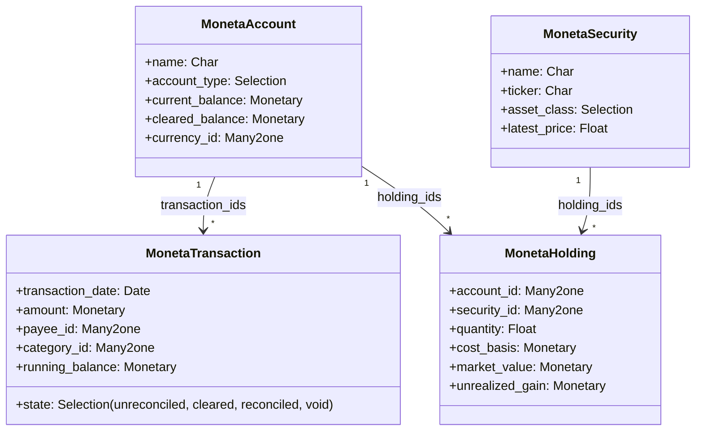

# Developer Architecture & Extensibility Guide

Moneta is built using modern **Odoo 18.0** design patterns with high modularity and clean separation of concerns.

---

## 1. Core Model Architecture



---

## 2. Scheduled Cron Jobs

| Cron XML ID | Method Target | Interval | Purpose |
| :--- | :--- | :--- | :--- |
| `cron_moneta_fetch_security_quotes` | `moneta.security._cron_fetch_live_quotes()` | Hourly | Updates Yahoo Finance stock prices |
| `cron_moneta_process_recurring_bills` | `moneta.scheduled.bill._cron_check_due()` | Daily | Flags due bills and triggers notifications |
| `cron_moneta_detect_subscriptions` | `moneta.subscription.detector._cron_scan()` | Weekly | Scans cadence for recurring SaaS charges |

---

## 3. Extending the Dashboard Launchpad

To add custom 1-click action buttons to the Executive Dashboard Launchpad:

```xml
<record id="action_launchpad_custom_report" model="moneta.dashboard.action">
    <field name="name">Monthly Tax Summary</field>
    <field name="icon">fa-file-text-o</field>
    <field name="color_class">primary</field>
    <field name="action_type">act_window</field>
    <field name="res_model">moneta.tax.report</field>
    <field name="sequence">10</field>
</record>
```

---

## 4. Running Automated Tests

Execute the full test suite with:

```bash
./odoo-bin -c odoo.conf -d <your_database> -u moneta_finance \
  --test-enable --test-tags=moneta_finance --stop-after-init
```
