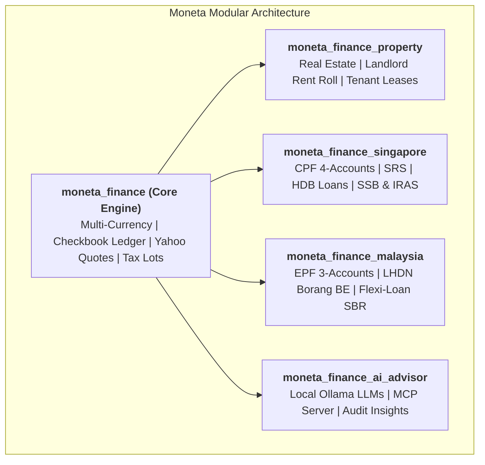

<div class="moneta-hero" markdown>

# Moneta Personal Finance

**An Open-Source Personal Finance, Banking & Wealth Management Suite for Odoo 18.**

*Combining the financial depth of Quicken Premier, the behavioral discipline of YNAB, the visual elegance of Monarch & Copilot, and the sovereign privacy of Odoo.*

<div class="moneta-badges">
  
  
  
  
</div>

[:material-rocket-launch: Quickstart Guide](01_GETTING_STARTED.md){ .md-button .md-button--primary }
[:material-github: GitHub Repository](https://github.com/lohwswilson/moneta_finance){ .md-button }

</div>

---

## 🌟 Sovereign Wealth Platform

**Moneta Personal Finance** is a 100% self-hosted, sovereign personal finance suite built on the enterprise-grade **Odoo 18** ORM and PostgreSQL backend.

Unlike closed cloud SaaS applications (Mint, Monarch, YNAB) that monetize your financial data behind monthly subscriptions, Moneta runs entirely on your own private infrastructure with **zero third-party tracking**, **native real-time multi-currency support**, and **direct local AI / MCP agent integration**.



---

## 📚 Complete Documentation Library

<div class="grid cards" markdown>

-   :material-rocket-launch: **[1. Getting Started & Setup](01_GETTING_STARTED.md)**

    ---

    Prerequisites, 30-second Docker setup, native Odoo 18 installation, and base currency configuration.

-   :material-bank: **[2. Banking & Checkbook Registers](02_BANKING_AND_RECONCILIATION.md)**

    ---

    Quicken-style running balances, cross-currency transfers, 1-click `Clr` toggles, and statement reconciliation wizards.

-   :material-chart-line: **[3. Stocks & Investment Center](03_STOCKS_AND_INVESTMENTS.md)**

    ---

    Composite brokerage model (Cash vs Holdings), live Yahoo Finance quotes, average cost basis, and corporate actions.

-   :material-bullseye-arrow: **[4. Budgets & Scheduled Bills](04_BUDGETS_BILLS_AND_SUBSCRIPTIONS.md)**

    ---

    Payday envelope budgeting, 14-day bill reminder horizons, and AI subscription price creep detection.

-   :material-home-city: **[5. Real Estate & Loan Amortization](05_REAL_ESTATE_AND_AMORTIZATION.md)**

    ---

    Property appraisal tracking, net home equity, mortgage debt metrics, and loan prepayment savings simulators.

-   :material-fire: **[6. FIRE & Wealth Simulator](06_FIRE_AND_SIMULATION.md)**

    ---

    Emergency liquid runway, Trinity 4% FIRE milestone, and 1,000-path stochastic Monte Carlo wealth projections.

-   :material-shield-lock: **[7. Security & Household Privacy](07_SECURITY_AND_MULTI_USER.md)**

    ---

    Record-level user isolation, joint family account sharing, and time-delayed digital estate emergency access.

-   :material-flag-checkered: **[8. Singapore & SEA Wealth](09_SINGAPORE_AND_SEA_WEALTH.md)**

    ---

    CPF (OA/SA/MA/RA), CPF LIFE simulator, SRS tax optimization, HDB loans, SORA mortgages, SSB, and IRAS relief.

-   :material-palm-tree: **[9. Malaysia Wealth & Tax Pack](10_MALAYSIA_WEALTH_AND_TAX.md)**

    ---

    EPF/KWSP 3-Account restructuring, LHDN Borang BE Tax Relief Planner, PRS, ASNB Unit Trusts, and Semi-Flexi Loans.

-   :material-code-braces: **[10. Developer Architecture & MCP](08_DEVELOPER_AND_API.md)**

    ---

    Entity relationship diagrams (ERD), automated cron jobs, custom dashboard launchpad actions, and testing.

</div>

---

## ⚡ 30-Second Quickstart (Docker)

```bash
# Clone the repository
git clone https://github.com/lohwswilson/moneta_finance.git
cd moneta_finance

# Launch Odoo 18 with Moneta pre-loaded
docker compose up -d
```

Open your browser at **`http://localhost:8069`** (Default login: `admin` / `admin`).
