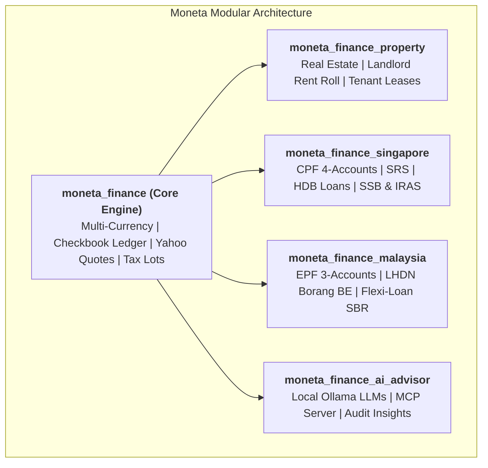

  ✨ Open-Source Sovereign Wealth Suite

<h1 class="hero-title">Take Sovereign Control of Your Wealth.</h1>

  Combining the ledger precision of Quicken Premier, the zero-based envelope discipline of YNAB, the visual elegance of Monarch & Copilot, and 100% self-hosted privacy.

  <a href="01_GETTING_STARTED/" class="md-button md-button--primary">
    🚀 Get Started in 30s
  </a>
  <a href="https://github.com/lohwswilson/moneta_finance" class="md-button">
    ⭐ Star on GitHub
  </a>

  

    

    

    

    
bash — docker-compose

  

  

    
$ git clone https://github.com/lohwswilson/moneta_finance.git

    
$ cd moneta_finance

    
$ docker compose up -d # Ready at http://localhost:8069

  

  
🔒 100% Self-Hosted & Private

  
🌐 Native Multi-Currency

  
🚫 Zero Cloud Telemetry

  
🤖 Local AI & MCP Ready

  
📊 1,000-Path Monte Carlo

---

## 🌟 The 6 Pillars of Wealth Management

-   ### 🏦 [1. Checkbook Registers & Reconciliation](02_BANKING_AND_RECONCILIATION.md)

    ---

    **Quicken-Style Ledger Precision**

    Point-in-time running balance recalculation with credit-before-debit chronological tiebreaking, two-legged cross-currency transfers, 1-click `Clr` toggles, and interactive bank statement reconciliation wizards.

-   ### 📈 [2. Stock Portfolio & Asset Intelligence](03_STOCKS_AND_INVESTMENTS.md)

    ---

    **Live Market Intelligence & Tax Lots**

    Live Yahoo Finance hourly quote sync, composite brokerage ledger (Cash vs Holdings), multi-lot average cost basis, tax-lot matching strategies (FIFO, LIFO, HIFO, Specific ID), and stock split adjustments.

-   ### 🎯 [3. Zero-Based Envelope Budgeting](04_BUDGETS_BILLS_AND_SUBSCRIPTIONS.md)

    ---

    **YNAB-Style Discipline**

    "Give Every Dollar a Job" with Ready-to-Assign (RTA) cash guardrails, automated credit card payment reserve shifts, 14-day bill reminder horizons, payday schedules, and subscription price creep detection.

-   ### 🌊 [4. Cash Flow & Scenario Forecasting](roadmap.md)

    ---

    **Monarch-Style Interactive Analytics**

    Interactive Cash Flow Sankey diagrams, 12-month forward cash flow and "what-if" scenario forecasting, collaborative "Needs Review" inbox triage, and automated category split rules.

-   ### 🎲 [5. FIRE & Monte Carlo Wealth Simulator](06_FIRE_AND_SIMULATION.md)

    ---

    **Institutional Stochastic Modeling**

    Emergency liquid runway indicator, Trinity Study 4% rule FIRE milestones, and 1,000-path stochastic Monte Carlo simulations with $P_{10}/P_{50}/P_{90}$ percentile curves and Sequence of Returns Risk testing.

-   ### 🌏 [6. Singapore & Malaysia Regional Packs](09_SINGAPORE_AND_SEA_WEALTH.md)

    ---

    **Localized SEA Wealth Hubs**

    Native Singapore CPF (OA/SA/MA/RA), CPF LIFE simulator, SRS tax exemptions, HDB loans, Malaysia EPF 3-Account Hub, LHDN Borang BE Tax Relief Planner, and Semi-Flexi Loans.

---

## 📊 How Moneta Compares

| Feature / Capability | Moneta Personal Finance | Quicken Premier | YNAB | Monarch Money | Cloud Mint / SaaS |
| :--- | :---: | :---: | :---: | :---: | :---: |
| **100% Self-Hosted & Sovereign** | ✔ Yes | ✖ No | ✖ No | ✖ No | ✖ No |
| **Recurring Monthly Cost** | ✔ $0 / Free | $70+ / year | $109 / year | $100 / year | Free (Ad-Tracked) |
| **Multi-Currency Ledgers & Transfers** | ✔ Native | Partial | ✖ No | ✖ No | ✖ No |
| **Live Yahoo Finance Stock Quotes** | ✔ Hourly Sync | ✔ Yes | ✖ No | ✔ Yes | ✖ No |
| **1,000-Path Monte Carlo Wealth Simulator** | ✔ Built-in | ✖ No | ✖ No | ✖ No | ✖ No |
| **Local AI & MCP Server (Ollama)** | ✔ Native MCP | ✖ No | ✖ No | ✖ No | ✖ No |
| **Regional Packs (CPF, SRS, EPF, LHDN)** | ✔ Native | ✖ No | ✖ No | ✖ No | ✖ No |

---

## 🏛️ Modular Suite Architecture

---

  <h3 style="margin-top: 0; font-size: 1.5rem; font-weight: 700;">Ready to take sovereign control of your finances?</h3>
  
Get up and running on your own private infrastructure in under a minute with Docker.

  

    <a href="01_GETTING_STARTED/" class="md-button md-button--primary">🚀 Launch Quickstart</a>
    <a href="02_BANKING_AND_RECONCILIATION/" class="md-button">📖 Browse User Guide</a>
  

