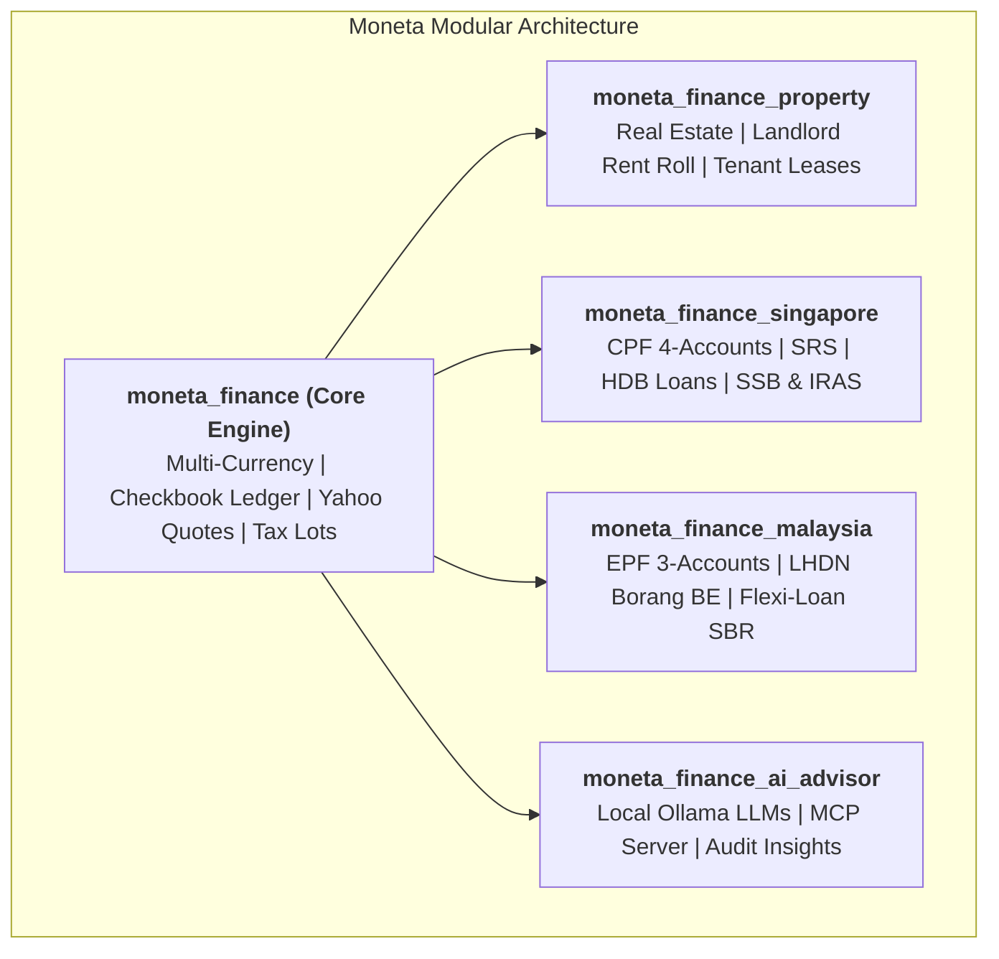

<div class="hero-wrapper" markdown>

<div class="hero-pill">
  <span>✨ Built natively for Odoo 18.0</span>
</div>

<h1 class="hero-title">Sovereign Wealth & Personal Finance Suite</h1>

<p class="hero-subtitle">
  Combining the depth of Quicken Premier, the discipline of YNAB, the visual elegance of Monarch & Copilot, and the complete privacy of Odoo 18.
</p>

<div class="hero-actions">
  <a href="01_GETTING_STARTED/" class="md-button md-button--primary">
    :material-rocket-launch: Get Started
  </a>
  <a href="https://github.com/lohwswilson/moneta_finance" class="md-button">
    :material-github: Star on GitHub
  </a>
</div>

</div>

---

## ⚡ 30-Second Quickstart

Get up and running with a complete PostgreSQL 16 and Odoo 18 stack with Moneta pre-installed:

```bash
# 1. Clone the repository
git clone https://github.com/lohwswilson/moneta_finance.git
cd moneta_finance

# 2. Launch Odoo 18 & PostgreSQL with Docker
docker compose up -d
```

Open [**`http://localhost:8069`**](http://localhost:8069) (Default login: `admin` / `admin`).

---

## 🌟 Sovereign Wealth Platform Capabilities

<div class="grid cards" markdown>

-   :material-bank: **[Quicken-Style Registers](02_BANKING_AND_RECONCILIATION.md)**

    ---

    Point-in-time running balances with credit-before-debit chronological tiebreaking, two-legged cross-currency transfers, 1-click `Clr` toggles, and statement reconciliation wizards.

-   :material-chart-line: **[Stock & ETF Intelligence](03_STOCKS_AND_INVESTMENTS.md)**

    ---

    Live Yahoo Finance hourly quote sync, composite brokerage ledger (Cash vs Holdings), multi-lot average cost basis, tax-lot accounting (FIFO/LIFO/HIFO), and corporate split adjustments.

-   :material-bullseye-arrow: **[YNAB Zero-Based Budgeting](04_BUDGETS_BILLS_AND_SUBSCRIPTIONS.md)**

    ---

    "Give Every Dollar a Job" with Ready-to-Assign (RTA) cash guardrails, automated credit card payment reserve shifts, 14-day bill horizons, and smart targets.

-   :material-chart-sankey: **[Monarch Cash Flow Visualizer](ROADMAP.md)**

    ---

    Interactive Cash Flow Sankey diagrams, 12-month forward cash flow scenario forecasting, collaborative "Needs Review" triage inbox, and subscription price creep alerts.

-   :material-fire: **[FIRE & Wealth Simulator](06_FIRE_AND_SIMULATION.md)**

    ---

    Emergency liquid runway indicator, Trinity Study 4% rule FIRE milestones, and 1,000-path stochastic Monte Carlo wealth projections with $P_{10}/P_{50}/P_{90}$ percentile bands.

-   :material-flag-checkered: **[Singapore & Malaysia Packs](09_SINGAPORE_AND_SEA_WEALTH.md)**

    ---

    Native Singapore CPF (OA/SA/MA/RA), CPF LIFE simulator, SRS tax exemptions, HDB loans, Malaysia EPF 3-Account Hub, LHDN Borang BE Tax Relief Planner, and Semi-Flexi Loans.

</div>

---

## 🏛️ Modular Multi-Addon Architecture

Moneta is engineered as a clean, modular suite of Odoo addons:



---

## 🔒 100% Privacy & Sovereign Data Ownership

Unlike closed cloud personal finance apps (Mint, Monarch, YNAB) that monetize user financial history or lock accounts behind recurring monthly fees, Moneta runs entirely on your own private infrastructure with **zero cloud data broker tracking**, **native real-time multi-currency support**, and **direct local AI / MCP agent integration**.
