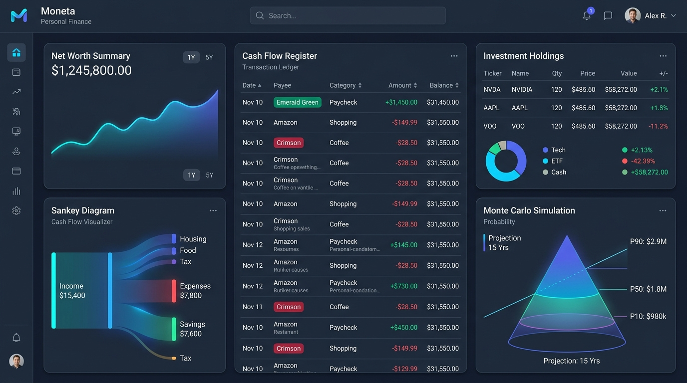
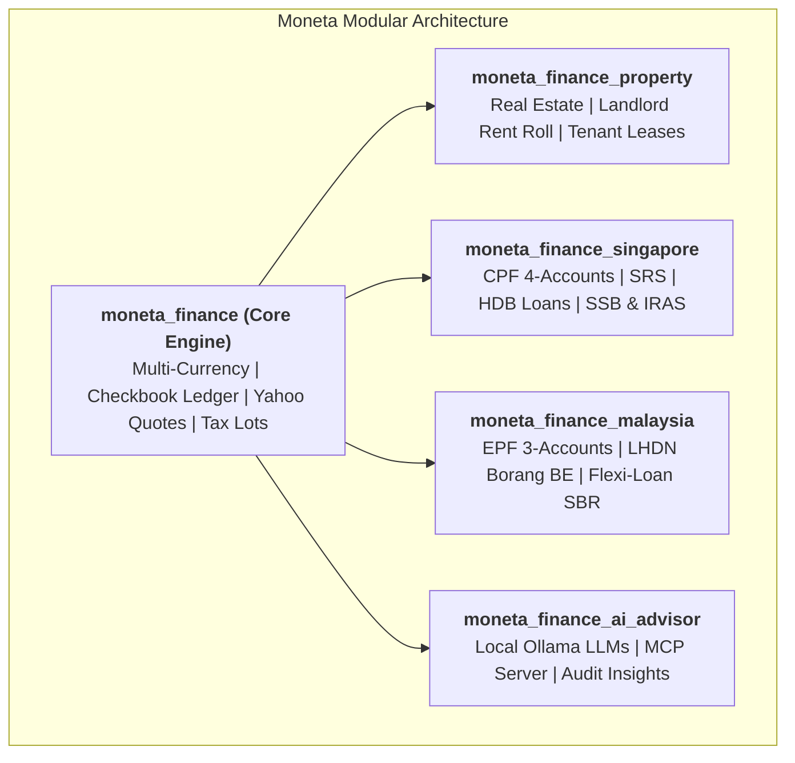

# Moneta Personal Finance

### **Institutional Precision. Zero Tracking. 100% Sovereign Wealth Management.**

**Moneta Personal Finance** is an open-source, self-hosted wealth management suite combining the checkbook ledger precision of **Quicken Premier**, the zero-based envelope budgeting discipline of **YNAB**, the modern visual clarity of **Monarch & Copilot**, and the complete sovereign privacy of your own private database.

[🚀 Get Started in 30 Seconds](01_GETTING_STARTED.md){ .md-button .md-button--primary }
[⭐ Star on GitHub](https://github.com/lohwswilson/moneta_finance){ .md-button }

<div style="margin: 2.5rem 0 3rem 0; text-align: center;">
  
</div>

---

## ⚡ 30-Second Quickstart

Get up and running with Docker and persistent storage in seconds:

```bash
# 1. Clone the repository
git clone https://github.com/lohwswilson/moneta_finance.git
cd moneta_finance

# 2. Launch Moneta with Docker
docker compose up -d
```

Open [**`http://localhost:8069`**](http://localhost:8069) in your browser (Default login: `admin` / `admin`).

---

## 🌟 Core Wealth Capabilities

<div class="grid cards" markdown>

-   ### 🏦 [1. Checkbook Registers & Reconciliation](02_BANKING_AND_RECONCILIATION.md)

    ---

    **Quicken-Style Ledger Precision**

    Point-in-time running balance recalculation with credit-before-debit chronological tiebreaking, two-legged cross-currency transfers, 1-click `Clr` toggles, and interactive bank statement reconciliation wizards.

-   ### 📈 [2. Stock Portfolio & Asset Intelligence](03_STOCKS_AND_INVESTMENTS.md)

    ---

    **Live Market Intelligence & Tax Lots**

    Live Yahoo Finance hourly quote sync, composite brokerage ledger (Cash vs Holdings), multi-lot average cost basis, tax-lot matching strategies (FIFO, LIFO, HIFO, Specific ID), and stock split adjustments.

-   ### 🎯 [3. Zero-Based Envelope Budgeting](04_BUDGETS_BILLS_AND_SUBSCRIPTIONS.md)

    ---

    **YNAB-Style Discipline**

    "Give Every Dollar a Job" with Ready-to-Assign (RTA) cash guardrails, automated credit card payment reserve shifts, 14-day bill reminder horizons, payday schedules, and subscription price creep detection.

-   ### 🌊 [4. Cash Flow & Scenario Forecasting](roadmap.md)

    ---

    **Monarch-Style Interactive Analytics**

    Interactive Cash Flow Sankey diagrams, 12-month forward cash flow and "what-if" scenario forecasting, collaborative "Needs Review" inbox triage, and automated category split rules.

-   ### 🎲 [5. FIRE & Monte Carlo Wealth Simulator](06_FIRE_AND_SIMULATION.md)

    ---

    **Institutional Stochastic Modeling**

    Emergency liquid runway indicator, Trinity Study 4% rule FIRE milestones, and 1,000-path stochastic Monte Carlo simulations with $P_{10}/P_{50}/P_{90}$ percentile curves and Sequence of Returns Risk testing.

-   ### 🌏 [6. Singapore & Malaysia Regional Packs](09_SINGAPORE_AND_SEA_WEALTH.md)

    ---

    **Localized SEA Wealth Hubs**

    Native Singapore CPF (OA/SA/MA/RA), CPF LIFE simulator, SRS tax exemptions, HDB loans, Malaysia EPF 3-Account Hub, LHDN Borang BE Tax Relief Planner, and Semi-Flexi Loans.

</div>

---

## 📊 How Moneta Compares

| Feature / Capability | Moneta Personal Finance | Quicken Premier | YNAB | Monarch Money | Cloud Mint / SaaS |
| :--- | :---: | :---: | :---: | :---: | :---: |
| **100% Self-Hosted & Sovereign** | **✔ Yes** | ✖ No | ✖ No | ✖ No | ✖ No |
| **Recurring Monthly Cost** | **✔ Free / $0** | $70+ / year | $109 / year | $100 / year | Free (Ad-Tracked) |
| **Multi-Currency Ledgers & Transfers** | **✔ Native** | Partial | ✖ No | ✖ No | ✖ No |
| **Live Yahoo Finance Stock Quotes** | **✔ Hourly Sync** | ✔ Yes | ✖ No | ✔ Yes | ✖ No |
| **1,000-Path Monte Carlo Wealth Simulator** | **✔ Built-in** | ✖ No | ✖ No | ✖ No | ✖ No |
| **Local AI & MCP Server (Ollama)** | **✔ Native MCP** | ✖ No | ✖ No | ✖ No | ✖ No |
| **Regional Packs (CPF, SRS, EPF, LHDN)** | **✔ Native** | ✖ No | ✖ No | ✖ No | ✖ No |

---

## 🏛️ Modular Architecture



---

## 🚀 Next Steps

* **[Get Started Guide](01_GETTING_STARTED.md)**: 30-second Docker setup or manual local installation.
* **[User Guide](02_BANKING_AND_RECONCILIATION.md)**: Explore banking, stocks, budgets, and FIRE simulation.
* **[Regional Wealth Packs](09_SINGAPORE_AND_SEA_WEALTH.md)**: Singapore CPF/SRS and Malaysia EPF localization.
* **[Developer Guide](dev_setup.md)**: Local development environment, API, and architectural conventions.
